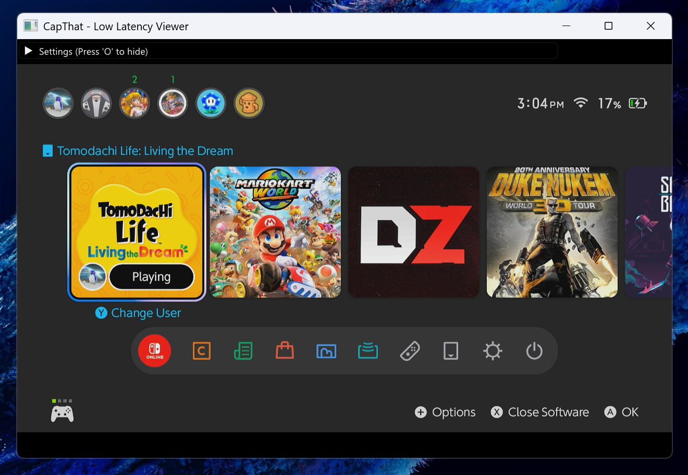

# 🌌 CapThat

**CapThat** is a high-performance, low-latency video capture viewer built for Windows. Designed with speed and minimal overhead in mind, it provides a seamless way to monitor capture cards, cameras, and video inputs with near-zero delay.




---

## ✨ Key Features

- ⚡ **Low Latency**: Leverages Windows Media Foundation and DXGI for hardware-accelerated frame processing.
- 🎮 **Pro-Grade Capture**: Automatically selects the highest framerate and resolution supported by your device.
- 🖼️ **Simple UI**: Modern, sleek interface powered by Dear ImGui with a focus on usability.
- 📸 **High-Quality Screenshots**: Export pixel-perfect PNGs directly from the capture stream.
- 🔉 **Integrated Audio**: Real-time audio monitoring with built-in mute functionality.
- 🗔 **Window Management**:
  - Always-on-Top mode.
  - Seamless Fullscreen transition.
  - Persistent settings (window position, capture choice, etc.).
- 🚀 **Lightweight**: Optimized footprint, no bloated dependencies.

---

## 🛠️ Tech Stack

- **Core**: C++17
- **Graphics**: DirectX 11 (D3D11)
- **Capture API**: Windows Media Foundation (IMFSourceReader)
- **Audio**: [miniaudio](https://github.com/mackron/miniaudio)
- **UI Framework**: [Dear ImGui](https://github.com/ocornut/imgui)
- **Image Export**: [stb_image_write](https://github.com/nothings/stb)

---

## 🚀 Getting Started

### Prerequisites (for building)

- **Windows 10/11**
- **CMake** (3.20+)
- **Visual Studio 2022** (or any C++17 compatible compiler)
- A valid Video Capture Device (Capture Card, Webcam, etc.)

### Build Instructions

1. **Clone the repository**:
   ```bash
   git clone https://github.com/yourusername/CapThat.git
   cd CapThat
   ```

2. **Configure with CMake**:
   ```bash
   mkdir build
   cd build
   cmake ..
   ```

3. **Build**:
   ```bash
   cmake --build . --config Release
   ```

4. **Run**:
   Launch `CapThat.exe` from the `Release` folder.

---

## 🎮 Controls

| Action | Description |
| :--- | :--- |
| `O` | Enable Settings Menu |
| `F11` | Toggle Fullscreen |
| `M` | Toggle Mute |
| `H` | Hide/Show UI |
| `S` | Take Screenshot |
| `T` | Toggle Always-on-Top |

---

## 📜 License

This project is licensed under the MIT License - see the [LICENSE](LICENSE) file for details.

---

<p align="center">
  Built with ❤️ for performance enthusiasts.
</p>
